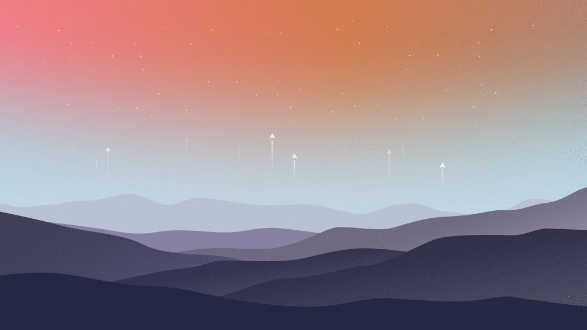
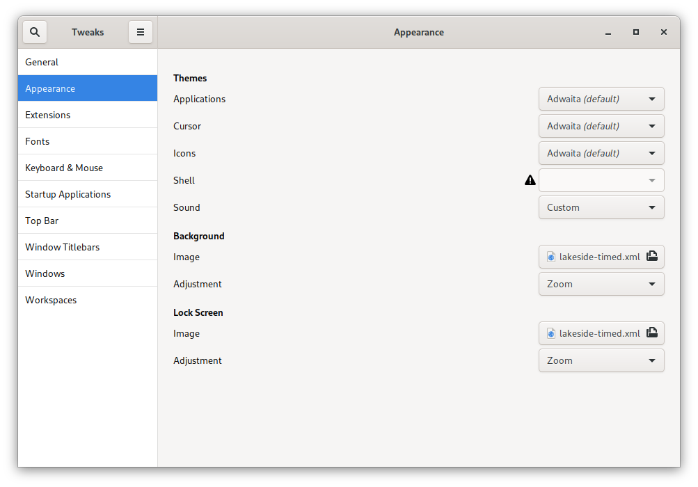

# Timed Wallpapers

Sometimes, I gather up wallpapers and make them timed (to work in GNOME). I then delete, or reinstall, and lose the work.

I decided to save those wallpapers here. All rights on those images go out to the original creators.


# Exodus

Source: [github.com/b1illzard-34](https://github.com/b1izzard-34/Dynamic-gnome-wallpapers)



# Lakeside

Source: [Louis Coyle](https://dribbble.com/shots/6498887-Lakeside-2019)


# Installation

Place the directories in either `/usr/share/backgrounds/` or `~/.local/share/backgrounds/` and select the `timed.xml` using **GNOME Tweaks**




## Notes

GIF Images have been generated using:

```bash
# Exodus
convert -resize 20% -delay 120 -loop 0 Exodus-morning.jpeg Exodus-afternoon.jpeg Exodus-evening.jpeg Exodus-night.jpeg exodus_preview.gif

# Lakeside
convert -resize 20% -delay 120 -loop 0 lakeside-morning.png lakeside-afternoon.png lakeside-evening.png lakeside-night.png lakeside_preview.gif
```
